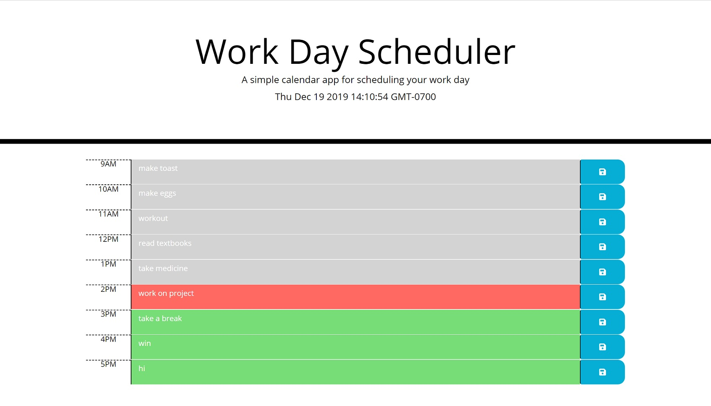
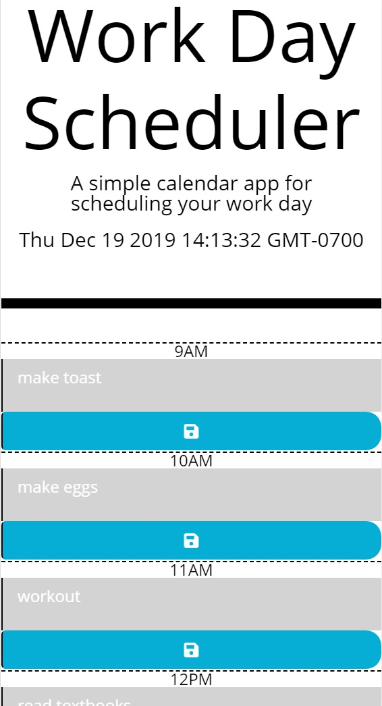

# Project Title
​
## Overview
​
The purpose of this application is to create a to do list in a scheduler and if you refresh the page it will keep the event loaded in each time block the user set it to.
​
### Gallery
​
Home:

​
Sign In:

​
​
## Tech and Features Used
​
* Bootstrap
* JQuery
* Local Storage
​
## How to use
​
There are time blocks for every hour of the work day from 9 am to 5 pm. in each time block there are text boxes for the user to type in the activity they would like to schedule. Once the user has typed in the text box they can click (or tap for mobile) the save button directly to the right of the text box. The save button will keep the information typed in the text box even after refresh. typing in new text and saving will override the current data stored. The schedular will also keep track of the time, and color the text box grey if the the time has passed, red if the block is current with the current time, or green if the event has yet to occur.
​
## Technical Overview
​
1. moment() keeps the time, moment().hours() holds just the hours that pass
2. moment() is set to an interval function that updates every second, making it seem like the clock is countint up.
3. A function called hoursUdater starts the function that first assigns moment().hours() to a variable called currentHour and then starts a .each method.
4. The .each method will run through each time block to create a variable (blockKey) that will reference a key reprented in each block of time. 
5. The method will also look for data saved in local storage that have keys that links to (blockKey) and set the text content of that data to the text area.
6. This starts the if else function that changes the color of each time block to represent one of three things: if the time block occurs before the current time the block will be grey, if the time occurs at the same time of the current time the time block will be red, and if the time block happens after the current time the the color will be green.
7. The save button to the right will save the data input from the user in the textbox of each timeblock to local storage with a key generated by the id of the timeblock.
